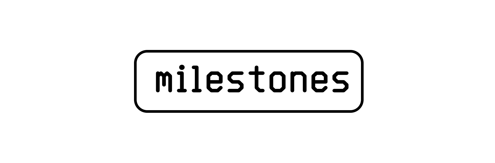

# 

LaTeX for the milestone deliverables for feedback during the thesis project and any other relevant documents (e.g. ethics application, cost breakdown) used throughout the thesis project.

During the thesis project, it is mandatory to hand in 5 milestones of subsections of the paper and to give peer feedback to other students to pass for the thesis. If no submission is made for one or more of the milestones, the UvA supervisor will be advised to consider terminating the thesis.

## Install

These documents are written in VSCode using the LaTeX Workshop Extension. The `.vscode` folder sets up the configuration environment for the correct building of the references using this structure.

1) Install a code editor such as [VSCode](https://vscode.dev/).
2) Install the [LaTeX Workshop extension](https://github.com/James-Yu/LaTeX-Workshop) for VSCode.
3) Clone this repository to your local machine.

```zsh
$ git clone git@github.com:viszlab/milestones.git
```
4. Open the `setup.tex` file in the relevant document folder and [build the output .pdf](https://github.com/James-Yu/LaTeX-Workshop/wiki/Install#usage).


## Documents

```
├── .vscode                 # LaTeX workshop configuration files
├── cost-breakdown          # BOM of the materials for declaration
├── data-collection         # Overview of data gathered by devices
├── ethics-application      # User studies application for ECIS
├── project-proposal        # Submitting the project in datanose
├── thesis-design           # Milestone #1: Thesis Design
├── literature-review       # Milestone #2: Literature Review
├── methodolog-section      # Milestone #3: Draft methodology section
├── pre-draft-thesis        # Milestone #4: Draft results section
└── draft-thesis            # Milestone #5: Draft full thesis
```

## Project
[**Viszlab**](https://wwww.viszlab.github.io) is a tangible physical data visualization for the [Lab42](https://lab42.uva.nl/) building. An interactive experience using environment sensor data to offer Human Building-Interaction. Viszlab is developed as a Thesis and Graduation project for the Master (MSc) Information Studies: [Information Systems](https://www.uva.nl/shared-content/programmas/en/masters/information-studies/information-studies.html) (track) at the [University of Amsterdam](https://www.uva.nl/en) by part-time student [Danny de Vries](https://www.dandevri.es/).

* **Master**: Master Information Studies: Information Systems (track)
* **University**: University of Amsterdam (UvA)
* **Institute**: Informatics Institute
* **Faculty**: Faculty of Science (FNWI)
* **Research Group**: Digital Interactions Lab (DIL)
* **Student**: BSc Danny de Vries (14495643)
* **Supervisor**: Dr. H. (Hamed) Seiied Alavi PhD

[Viszlab](https://www.viszlab.github.io) © 2024 by [Danny de Vries](https://wwww.github.com/dandevri) is licensed under [CC BY-NC-SA 4.0](http://creativecommons.org/licenses/by-nc-sa/4.0/?ref=chooser-v1). 